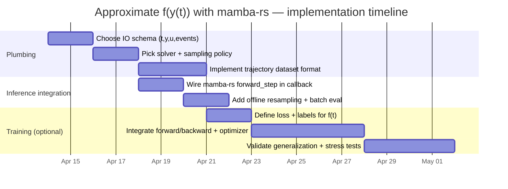

# Approximating a Function of ODE State Trajectories with `mamba-rs` in Rust

## Executive summary

You can use **`mamba-rs` (the crate in `AlHeloween/mamba-rs`) as a *stateful sequence model* to approximate** an unknown scalar/vector function  
\[
f\big(y_1(t),y_2(t),y_3(t),y_4(t)\big)
\]
by learning (or implementing) a mapping from the **4D ODE state** (optionally plus time \(t\), controls \(u(t)\), and event flags) into a predicted \(f(t)\). The key implementation idea is: **treat the ODE solution samples as a time series input to Mamba**, and either compute \(f\) **online** (at each solver step) or **offline** (post-process a stored solution, possibly using interpolation/dense output to query arbitrary \(t\)). fileciteturn4file0L1-L1

A critical correction: **`mamba-rs` is not an ODE solver library**. It does not provide generic ODE integrators, event root finding, or dense-output interpolation APIs the way ODE libraries do. In this repo, “SSM” refers to **Mamba’s internal selective state-space recurrence** for sequence modeling; you still select a separate ODE solver (or produce data from an existing solver) and then use `mamba-rs` as the function approximator on top. fileciteturn4file0L1-L1 citeturn10search3

Practically, you implement \(f\) approximation in Rust with three reusable building blocks:

- **Representation**: Pack \([y_1,y_2,y_3,y_4]\) (and optionally \(t, u(t)\), event markers) into a fixed-length `&[f32]` input vector; treat `d_model` as your output dimension (often `1` for scalar \(f\)). `mamba-rs` uses `f32` for weights, state, and inference. fileciteturn5file0L1-L1 fileciteturn12file0L1-L1  
- **Online evaluation**: Call `MambaBackbone::forward_step(...)` once per ODE solver step (or once per resampled time step) and store/output \(f\) immediately. This is the cleanest “callback-like” integration. fileciteturn11file0L1-L1  
- **Offline + interpolation**: Use an ODE solver’s dense output (or your own interpolation of saved \((t,y)\) points) to query \(\hat y(t)\) at arbitrary times, then evaluate the Mamba model at those \(t\). For example, `ode_solvers` (a separate crate) provides a `ContinuousOutputModel` with an `evaluate(t)` method for this workflow. citeturn17search0turn17search1

The most important implementation constraints and decisions:

- **Model-vs-solver responsibility split**: ODE numerical accuracy is governed by the ODE solver (e.g., adaptive Dormand–Prince); Mamba accuracy is governed by training + input normalization + whether you give it enough context/history. citeturn17search0turn20search1  
- **Memory/performance**: `mamba-rs` is designed for **zero heap allocations per inference step** by pre-allocating recurrent state and scratch buffers. Your code should mirror that: reuse `input` buffers, avoid per-step `Vec` creation, and reset state at sequence boundaries. fileciteturn11file0L1-L1 fileciteturn19file0L1-L1  
- **Versioning**: the inspected repo’s `Cargo.toml` declares **`mamba-rs` version `0.2.1`**, Rust **edition 2024**, and **`rust-version = "1.94"`** (MSRV). At the time of web lookup, `docs.rs` shows public releases in the **`0.1.x`** range; if you need APIs that exist only in this repo, depend on the **Git revision** rather than crates.io. fileciteturn5file0L1-L1 citeturn18search0turn18search2turn1search2

## What `mamba-rs` is and which features matter for approximating \(f(y(t))\)

### What the repo implements

The `AlHeloween/mamba-rs` repository implements **Mamba selective state-space models** in Rust, including **Mamba-1** and **Mamba-3 SISO**, with CPU inference/training and optional CUDA paths, plus `safetensors` serialization. fileciteturn4file0L1-L1

The crate exposes three “levels” of computational API that are directly relevant when you want to embed it into a simulation loop:

- **Layer step**: `mamba_layer_step(...)` (pure mixer, no norm/residual)  
- **Block step**: `mamba_block_step(...)` (pre-norm + mixer + residual)  
- **Full backbone step**: `mamba_step(...)` (input projection + N blocks + final norm) fileciteturn6file0L1-L1 fileciteturn14file0L1-L1

For practical usage, the repo provides a higher-level wrapper:

- **`MambaBackbone`**, which owns weights/config and provides **`forward_step`** (single-step recurrent inference) and **`forward_sequence`** (iterate \(T\) times) plus convenient allocation helpers for state and scratch. fileciteturn10file0L1-L1 fileciteturn11file0L1-L1

### What `mamba-rs` does not provide (relative to common ODE libraries)

Despite “state space” language, this repo **does not** implement generic ODE solving features such as:

- adaptive integrators for arbitrary \(y'(t)=g(t,y)\),
- dense output interpolation for ODE solutions,
- root-finding event detection and discontinuity handling for ODEs,
- parameter estimation specifically for ODE models (though it does provide **training/gradient** machinery for the Mamba model). fileciteturn4file0L1-L1 fileciteturn22file0L1-L1

In other words: **you provide \((t, y(t))\)** from somewhere (your solver, experimental data, playback logs), and `mamba-rs` approximates a target mapping based on that stream.

### Relevant features for your goal

For approximating \(f(y_1(t),\dots,y_4(t))\), the repo features that matter most are:

- **Recurrent state & scratch-buffer discipline**: persistent state (`MambaState`) is updated per step; scratch (`MambaStepScratch`) is reused per step and designed to avoid allocations. fileciteturn13file0L1-L1 fileciteturn14file0L1-L1  
- **CPU vs GPU inference**: CPU is “zero-allocation single-step recurrent forward pass”; CUDA inference can capture CUDA graphs for lower latency (useful for real-time simulation). fileciteturn4file0L1-L1  
- **Training/BPTT and weight layouts**: the repo includes explicit forward/backward passes and trainable weight containers, enabling you to **fit** the approximator to data rather than hand-coding \(f\). fileciteturn22file0L1-L1 fileciteturn28file0L1-L1  
- **Model composition / modularity**: depending on how you want to integrate with other code, you can either call the full backbone (`mamba_step` / `MambaBackbone`) or embed a layer/block step inside a custom compute graph. fileciteturn6file0L1-L1

## Representing \(y_1..y_4\) in `mamba-rs` (state vectors, types, configs)

### Data types and shape conventions

`mamba-rs` (this repo) uses **flat `Vec<f32>` buffers** for weights, recurrent state, and scratch. A single step consumes:

- `input: &[f32]` of length `input_dim`
- `output: &mut [f32]` of length `d_model` fileciteturn14file0L1-L1

The canonical high-level API (`MambaBackbone::forward_step`) expects:

- `input: &[f32]`
- `output: &mut [f32]`
- `state: &mut MambaState`
- `scratch: &mut MambaStepScratch` fileciteturn11file0L1-L1

So your 4D ODE state typically becomes:

- `input_dim = 4` if you approximate \(f(y(t))\) as memoryless and time-independent, or
- `input_dim = 5` if you include time \(t\) as a feature, or
- `input_dim = 4 + m + k` if you add \(m\) exogenous controls and \(k\) event/flag channels.

A very common practical choice is:
\[
x(t) = [\text{t\_scaled}, y_1(t), y_2(t), y_3(t), y_4(t)]
\]
where `t_scaled` is e.g. \(t/T\) or \(\log(1+t)\) to keep scales stable.

### Choosing `d_model` for “function approximation”

In this repo, `d_model` is the “model dimension” and also the **output dimension** of the backbone’s final projection. fileciteturn12file0L1-L1

For approximating a scalar \(f\), you have two viable patterns:

- Set `d_model = 1` so the backbone outputs a 1-element vector \([ \hat f(t) ]\). This is easiest for deployment and for integrating into callbacks, and it keeps the output buffer tiny.
- Keep `d_model` moderately sized (e.g., 32/64/128) and add a tiny hand-written linear “head” to map features → scalar. This can be useful if you want to reuse one backbone for multiple derived outputs or diagnostics.

If you choose `d_model = 1`, note the repo’s `MambaConfig::validate()` includes constraints meant for CUDA kernels—e.g., `d_inner = expand * d_model` must be divisible by 4—so you’d typically set `expand = 4` to satisfy vectorization assumptions if you intend to run on GPU. fileciteturn12file0L1-L1

### Recurrent state semantics and boundaries (how to treat each ODE trajectory)

The persistent state is explicitly modeled:

- each layer has `conv_state` (a shift register) and `ssm_state` (the hidden state), both stored in `Vec<f32>`, and the full backbone has `Vec<MambaLayerState>`. fileciteturn13file0L1-L1  
- state is **reset** at sequence/episode boundaries with `state.reset()`. fileciteturn13file0L1-L1

For ODE trajectories, you usually define “episode boundaries” as:

- each independent initial condition run,
- each event causing discontinuity (e.g., switching dynamics), or
- each segment you want the approximator to treat independently.

This choice directly determines whether your approximator is:

- **memoryless** (reset state often; prediction depends primarily on current input), or
- **history-aware** (carry state across time; prediction may depend on recent past, implicitly).

## Computing \(f\) from solution trajectories

### Online computation at solver steps (callback-style integration)

The conceptual callback signature you want is essentially:

```text
on_step(t: f64, y: [f64; 4], dy: [f64; 4]) -> ()
```

Inside that callback, you:

1. convert and pack `input: [f32; input_dim]`
2. call `backbone.forward_step(...)`
3. read `output[0]` (for scalar \(f\))
4. store/log/emit

This mirrors the “single-step recurrent forward” design of the crate, which is explicitly intended to be called step-by-step with state carry. fileciteturn11file0L1-L1 fileciteturn4file0L1-L1

If you also want to compute **derived quantities** (e.g., \(f\) plus partials, constraints, residuals), you can set `d_model` accordingly and treat the output vector as \([\hat f_1, \hat f_2, ...]\).

### Post-solution mapping (offline evaluation on stored \((t,y)\))

If you already have a stored solution (say `Vec<(t, [y1..y4])>`), you can evaluate \(f\) in two main ways:

- re-run an inference pass with `forward_step` in a loop, **reusing** state and scratch for speed; or
- pack the whole input sequence into a flat array and call `forward_sequence` once, which loops internally. fileciteturn11file0L1-L1

Offline evaluation is often preferable during development because it isolates performance/accuracy debugging: you can confirm that your ODE solution pipeline is correct before embedding inference into solver callbacks.

### Interpolation between solver steps (evaluating \(f\) at arbitrary \(t\))

If you need \(f(t)\) at arbitrary times (not just solver step boundaries), you have two main approaches:

- **Use the ODE solver’s dense output / continuous output model** (best when available).  
  For instance, the Rust crate `ode_solvers` provides a `ContinuousOutputModel` that is filled during integration and later queried by calling `evaluate(x)` returning `Option<State>`. citeturn17search0turn17search1  
- **Use your own interpolation on stored samples** (e.g., piecewise linear, cubic Hermite/splines). This is simpler but can reduce accuracy unless your step sizes are small or your dynamics are smooth.

If you choose dense output, note that even explicit Runge–Kutta methods can provide high-order interpolants. In `ode_solvers`, the README documents dense output orders, and the continuous output model is explicitly described as evaluating “the solution at any point in the integration interval.” citeturn17search0turn11search6

### Time-dependent inputs and events

Because `mamba-rs` only sees what you feed it, time-dependent forcing and events become **input engineering plus state management**:

- **Time-dependent forcing \(u(t)\)**: extend `input_dim` and include \(u(t)\) channels in the input vector. If \(u(t)\) is known analytically, compute it at the callback time. If it is piecewise constant, include the current segment value and optionally a “segment id” or one-hot.  
- **Events/discontinuities**: either
  - reset Mamba recurrent state at the event (treat post-event as a new episode), or
  - add an event flag input and let the model learn how to incorporate it, while still optionally resetting state when dynamics fundamentally change.

For ODE stepping with callbacks, `ode_solvers` exposes a per-step hook via `System::solout(...)` that “is called after each successful integration step and stops the integration whenever it is evaluated as true.” You can repurpose it as a step callback collector even if you never stop. citeturn17search0turn17search5

## Accuracy, solver choices, interpolation methods, and trade-offs

### ODE solver selection (external to `mamba-rs`)

If the goal is “approximate \(f(y(t))\)”, solver choice affects:

- the fidelity of training/evaluation targets,
- the time grid irregularity (adaptive stepping),
- the ease of interpolation/dense output.

Below is a practical comparison grounded in the Rust `ode_solvers` crate documentation (explicit RK methods) plus widely used solver guidance (SciPy) for stiff vs non-stiff selection.

| Category | Representative method / crate | Strengths | Risks / limits | When it fits the `mamba-rs` workflow |
|---|---|---|---|---|
| Fixed-step explicit RK | `Rk4` in `ode_solvers` | Simple, predictable step grid | No adaptive error control; can require very small `dt` for accuracy/stability | Good for generating uniform-grid sequences for Mamba; easiest to stream into `forward_step` citeturn17search0 |
| Adaptive explicit RK with dense output | `Dopri5` (order 5(4), dense output order 4) | Adaptive step sizes; has a continuous output model | Best for non-stiff problems; adaptive times may require resampling for ML pipelines | Great if you want dense output to query \(\hat y(t)\) at arbitrary times for post-processing \(f(t)\) citeturn17search0turn11search6 |
| Higher-order adaptive RK with denser output | `Dop853` (order 8(5,3), dense output order 7) | High precision with fewer steps for smooth problems | Still explicit: stiff problems can be hard | Useful for “high-fidelity truth data” generation; fewer integration steps can mean fewer Mamba calls if computing online citeturn11search4turn11search6 |
| Stiff solvers (implicit, BDF/Radau, etc.) | (not in `ode_solvers`) | Stability for stiff systems | Requires Jacobians/linear solves; different API | If your system is stiff, pair `mamba-rs` with a stiff-capable ODE solver crate; guidance commonly recommends implicit methods for stiff problems citeturn20search1 |

The stiffness caveat matters because the user constraints are “stiffness unspecified.” If you later discover stiffness (many tiny steps, failure, divergence), you should switch to a stiff solver rather than forcing explicit RK to work (a standard recommendation in solver docs). citeturn20search1

### Interpolation methods for querying \(y(t)\) and evaluating \(f\)

| Method | What it interpolates | Accuracy behavior | Implementation complexity | When to use |
|---|---|---|---|---|
| Solver dense output / continuous output | Uses per-step polynomial coefficients produced by the solver | Typically higher-order and consistent with solver order; avoids ad-hoc interpolation artifacts | Moderate (requires saving/using solver’s output model) | Best default when available; `ode_solvers` provides `ContinuousOutputModel::evaluate(t)` returning `Option<State>` citeturn17search0turn17search1 |
| Piecewise linear interpolation | \((t_k,y_k)\rightarrow y(t)\) linearly | Low order; can visibly distort derivatives and high-curvature dynamics | Very low | Acceptable for small `dt` or smooth signals; convenient for early prototypes |
| Cubic Hermite / spline | Smooth interpolation using slopes or spline conditions | Better smoothness; can overshoot; requires care at discontinuities | Moderate-high | Useful when you need smooth derivatives/features for the Mamba input, or when step spacing is wide and smoothness is required |

A practical workflow for Mamba-based approximation is: use solver dense output → resample onto a uniform grid → feed uniform samples into Mamba. This reduces one common ML failure mode: “irregular sampling” producing aliasing/implicit time encoding the model wasn’t trained for. The `ode_solvers` docs explicitly support building a continuous output model “to evaluate the solution at any point.” citeturn17search0

## Performance, memory, and Rust implementation considerations

### Zero-allocation inference is real, but only if you code for it

The repo repeatedly emphasizes **zero heap allocations per inference step** and pre-allocated buffers. For example:

- the README states “Zero heap allocations per inference step” and highlights pre-allocation. fileciteturn4file0L1-L1  
- the high-level `forward_step` call is explicitly documented as “Zero allocations per call” delegating to `mamba_step`. fileciteturn11file0L1-L1  
- benchmark docs reiterate that buffers are pre-allocated and no allocations occur per step. fileciteturn19file0L1-L1

To preserve that property when approximating \(f(y(t))\):

- allocate `MambaState` once per trajectory (or per batch element) and call `reset()` only at boundaries;
- allocate `MambaStepScratch` once;
- reuse a stack array like `[f32; 5]` for input rather than `Vec<f32>` in the inner loop;
- reuse the output buffer (`[f32; 1]` or `Vec<f32>`).

### CPU vs GPU considerations

The repo includes measured performance (example hardware in the docs), which matters if you’re evaluating \(f\) at every solver step:

- CPU single-step inference on default configs is on the order of **tens of microseconds per step** in the provided benchmark tables; GPU inference is faster per step especially with CUDA graph capture. fileciteturn19file0L1-L1 fileciteturn20file0L1-L1  
- CUDA graph capture is advertised as reducing launch overhead / improving latency. fileciteturn4file0L1-L1

For “compute \(f\) during ODE solving,” you should compare the cost of:
- ODE RHS evaluations (often heavy), vs
- Mamba inference cost.

If Mamba dominates, consider evaluating \(f\) on a coarser grid (e.g., every \(n\) solver steps or at fixed output times using dense output).

### Precision mismatches (f64 ODE vs f32 Mamba)

Many ODE solvers operate naturally in `f64`; `mamba-rs` operates in native `f32` (weights/state). fileciteturn4file0L1-L1

You need a policy:

- If \(f\) is downstream visualization / control logic tolerant of small noise, convert `f64 → f32` each call.
- If you need high-precision \(f\), train and evaluate carefully; otherwise `f32` quantization can dominate. (For GPU, TF32 may also appear in some matmul paths depending on kernels/hardware, which the docs discuss in performance/precision notes in published crate docs.) citeturn14search0

### Parameter estimation / training loop reality check

This repo includes the building blocks for training:

- forward/backward passes with BPTT through the recurrent state, and “hand-derived analytical gradients.” fileciteturn22file0L1-L1  
- trainable weight containers (`TrainMambaWeights`) designed for gradient accumulation. fileciteturn28file0L1-L1

But it does **not** appear to ship a full “fit()” API with optimizers; you typically bring your own optimizer (SGD/Adam) and update the `TrainMambaWeights` buffers (or convert between inference weights and train weights as appropriate). That’s normal for a “no-framework” crate, and it’s consistent with the repo’s positioning as standalone (no PyTorch/Burn/Candle). fileciteturn4file0L1-L1

## Implementation examples, diagrams, troubleshooting, and next steps

### Data flow diagram

```mermaid
flowchart LR
  A[ODE solver or recorded trajectories] --> B[(t, y1..y4)]
  B --> C{Sampling policy}
  C -->|online per step| D[Mamba forward_step<br/>state + scratch reused]
  C -->|offline| E[resample / interpolate y(t)]
  E --> D
  D --> F[output vector]
  F --> G[f_hat(t) = output[0] or head(output)]
  G --> H[log / control / loss / downstream model]
```

### Timeline to implement in Rust



### Rust code example: compute \(f\) at solver steps via a callback pattern

This example demonstrates the *shape* of the integration: a stepping loop (standing in for an ODE solver) calls an `on_step` closure that runs `MambaBackbone::forward_step` and collects `f_hat` at each step. It uses **pre-allocated state and scratch** and avoids per-step heap allocations for the model path.

```rust
// Cargo.toml (pick ONE):
//
// Option A: use the GitHub repo (recommended if you need the exact APIs from AlHeloween/mamba-rs)
// [dependencies]
// mamba-rs = { git = "https://github.com/AlHeloween/mamba-rs", rev = "main" }
//
// Option B: use crates.io (if you can live with the public 0.1.x API)
// [dependencies]
// mamba-rs = "0.1"

use mamba_rs::{MambaBackbone, MambaConfig};

/// Example 4D ODE stepper (toy): y' = A y (Euler step).
/// Replace this with your real ODE solver; the integration pattern is the same.
fn euler_step(y: &mut [f32; 4], dt: f32) {
    // A simple stable-ish linear system (for demo).
    let a = [
        [-0.10,  0.02, 0.00, 0.00],
        [ 0.00, -0.20, 0.01, 0.00],
        [ 0.00,  0.00, -0.05, 0.03],
        [ 0.00,  0.00, 0.00, -0.08],
    ];
    let dy = [
        a[0][0]*y[0] + a[0][1]*y[1] + a[0][2]*y[2] + a[0][3]*y[3],
        a[1][0]*y[0] + a[1][1]*y[1] + a[1][2]*y[2] + a[1][3]*y[3],
        a[2][0]*y[0] + a[2][1]*y[1] + a[2][2]*y[2] + a[2][3]*y[3],
        a[3][0]*y[0] + a[3][1]*y[1] + a[3][2]*y[2] + a[3][3]*y[3],
    ];
    for i in 0..4 {
        y[i] += dt * dy[i];
    }
}

fn main() {
    // We approximate scalar f(...) so we set d_model = 1.
    // For GPU friendliness in this repo, pick expand=4 so d_inner = expand*d_model is divisible by 4.
    let cfg = MambaConfig {
        d_model: 1,
        d_state: 16,
        d_conv: 4,
        expand: 4,
        n_layers: 2,
        scan_mode: Default::default(),
    };

    // Input features: [t_scaled, y1, y2, y3, y4] => input_dim=5
    let input_dim = 5usize;

    // Initialize a random model (for a real approximation, load trained weights).
    let backbone = MambaBackbone::init(cfg, input_dim, /*seed=*/ 42);

    // Allocate persistent state and scratch ONCE (zero-alloc in steady state).
    let mut state = backbone.alloc_state();
    let mut scratch = backbone.alloc_scratch();

    // Output buffer (size d_model = 1)
    let mut out = vec![0.0f32; backbone.config().d_model];

    // A callback-like collector for f_hat(t).
    let mut f_series: Vec<(f32, f32)> = Vec::new();

    // Initial condition for the ODE
    let mut t = 0.0f32;
    let dt = 0.01f32;
    let t_end = 1.0f32;
    let mut y = [1.0f32, 0.5f32, -0.25f32, 0.1f32];

    // "Episode boundary": reset the Mamba recurrent state before a new trajectory.
    state.reset();

    // Stepping loop (replace with real solver)
    while t <= t_end {
        // Build input without heap allocation in the steady-state loop
        let t_scaled = t / t_end.max(1e-6);
        let input = [t_scaled, y[0], y[1], y[2], y[3]];

        // Compute f_hat at this step
        backbone.forward_step(&input, &mut out, &mut state, &mut scratch);
        let f_hat = out[0];

        // Store (t, f_hat)
        f_series.push((t, f_hat));

        // Advance the ODE
        euler_step(&mut y, dt);
        t += dt;
    }

    // Demo output
    println!("Computed {} f_hat samples.", f_series.len());
    println!("First 5 samples:");
    for (ti, fi) in f_series.iter().take(5) {
        println!("t={:.3}, f_hat={:+.6}", ti, fi);
    }
}
```

This code is consistent with the repo’s intended usage of `MambaBackbone` + `alloc_state()` + `alloc_scratch()` + `forward_step()` and explicit `state.reset()` at boundaries. fileciteturn11file0L1-L1

### Rust code example: post-processing interpolated values to evaluate \(f\) at arbitrary \(t\)

This version uses an **actual ODE solver crate** (`ode_solvers`) to (a) integrate a 4D system, (b) build a continuous output model, and (c) evaluate \(\hat y(t)\) at arbitrary times via `continuous_output_model.evaluate(t)`—then calls `mamba-rs` to compute \(f\).

Key facts this is built on:

- `ode_solvers::System` trait provides `system(...)` and an optional per-step `solout(...)` hook. citeturn17search0turn17search5  
- `ode_solvers` supports building a `ContinuousOutputModel` during integration via `integrate_with_continuous_output_model(...)` and evaluating it with `evaluate(t)`. citeturn17search0turn17search1

```rust
// Cargo.toml (pick what you need):
//
// [dependencies]
// ode_solvers = "0.6.1"
// mamba-rs = { git = "https://github.com/AlHeloween/mamba-rs", rev = "main" }

use ode_solvers::dopri5::*;
use ode_solvers::{ContinuousOutputModel, System, Vector4};

use mamba_rs::{MambaBackbone, MambaConfig};

type Time = f64;
type State = Vector4<f64>;

/// A simple linear 4D ODE: y' = A y
struct Linear4 {
    a: [[f64; 4]; 4],
}

impl System<Time, State> for Linear4 {
    fn system(&self, _t: Time, y: &State, dy: &mut State) {
        // dy = A*y
        *dy = State::new(
            self.a[0][0] * y[0] + self.a[0][1] * y[1] + self.a[0][2] * y[2] + self.a[0][3] * y[3],
            self.a[1][0] * y[0] + self.a[1][1] * y[1] + self.a[1][2] * y[2] + self.a[1][3] * y[3],
            self.a[2][0] * y[0] + self.a[2][1] * y[1] + self.a[2][2] * y[2] + self.a[2][3] * y[3],
            self.a[3][0] * y[0] + self.a[3][1] * y[1] + self.a[3][2] * y[2] + self.a[3][3] * y[3],
        );
    }
}

fn main() {
    // -------------------------
    // 1) Solve the ODE + build continuous output model
    // -------------------------
    let system = Linear4 {
        a: [
            [-0.10,  0.02, 0.00, 0.00],
            [ 0.00, -0.20, 0.01, 0.00],
            [ 0.00,  0.00, -0.05, 0.03],
            [ 0.00,  0.00, 0.00, -0.08],
        ],
    };

    let t0: Time = 0.0;
    let t_end: Time = 10.0;
    let dt_init: Time = 1e-2;
    let y0: State = State::new(1.0, 0.5, -0.25, 0.1);
    let rtol: f64 = 1e-7;
    let atol: f64 = 1e-9;

    let mut stepper = Dopri5::new(system, t0, t_end, dt_init, y0, rtol, atol);

    let mut com: ContinuousOutputModel<Time, State> = ContinuousOutputModel::default();
    let _stats = stepper
        .integrate_with_continuous_output_model(&mut com)
        .expect("ODE integration failed");

    // -------------------------
    // 2) Build a Mamba model f_hat = Mamba(t, y)
    // -------------------------
    let cfg = MambaConfig {
        d_model: 1,
        d_state: 16,
        d_conv: 4,
        expand: 4,
        n_layers: 2,
        scan_mode: Default::default(),
    };

    // input = [t_scaled, y1..y4]
    let input_dim = 5usize;
    let backbone = MambaBackbone::init(cfg, input_dim, 123);

    let mut state = backbone.alloc_state();
    let mut scratch = backbone.alloc_scratch();
    let mut out = vec![0.0f32; backbone.config().d_model];

    // -------------------------
    // 3) Evaluate f at arbitrary query times using interpolated y(t)
    // -------------------------
    let query_times: Vec<Time> = (0..=20).map(|k| (k as f64) * 0.5).collect();

    println!("t, f_hat");
    for &tq in &query_times {
        let yq = com.evaluate(tq).expect("tq out of bounds");

        // If you want f_hat to depend ONLY on (t,y) and not on history:
        state.reset();

        let t_scaled = (tq / t_end).clamp(0.0, 1.0) as f32;
        let input = [
            t_scaled,
            yq[0] as f32,
            yq[1] as f32,
            yq[2] as f32,
            yq[3] as f32,
        ];

        backbone.forward_step(&input, &mut out, &mut state, &mut scratch);
        println!("{:.3}, {:+.6}", tq, out[0]);
    }
}
```

This example directly reflects the `ode_solvers` documentation for continuous output model construction and evaluation (`integrate_with_continuous_output_model`, then `evaluate(t)`), and uses the same `MambaBackbone::forward_step` pattern from the repo. citeturn17search0turn17search1 fileciteturn11file0L1-L1

### Solver option and interpolation comparison tables (ready-to-use)

If you want a quick “choose without overthinking” guide:

| If you need… | ODE solver recommendation | Interpolation recommendation | Rationale |
|---|---|---|---|
| Fast prototyping & uniform steps | fixed-step RK4 | none (already uniform) | simplest integration and simplest Mamba streaming citeturn17search0 |
| High precision on smooth, non-stiff dynamics | Dop853 | solver dense output (order 7) | fewer steps for a given tolerance; higher-order interpolant citeturn11search4turn11search6 |
| Moderate precision + dense output | Dopri5 | continuous output model evaluate(t) | good general-purpose; built-in dense output citeturn17search0turn17search1 |
| Suspected stiffness | implicit method (Radau/BDF-style) | solver-provided dense output if possible | standard solver guidance: explicit RK for non-stiff, implicit for stiff citeturn20search1 |

### Troubleshooting tips

Mamba-based \(f(y(t))\) approximation failures usually come from a few predictable sources:

- **State boundary mistake**: If your predicted \(f\) “drifts” across trajectories, you likely forgot to call `state.reset()` at the start of each new ODE rollout (or at discontinuities). `MambaState::reset()` is explicit and should be treated like “clear hidden state.” fileciteturn13file0L1-L1  
- **Silent per-step allocations**: If latency is unexpectedly high, check for `Vec` creation in your step loop. The repo provides `alloc_state()`/`alloc_scratch()` specifically so that steady-state inference can be allocation-free. fileciteturn11file0L1-L1  
- **Irregular solver steps confusing the model**: Adaptive stepping means the model implicitly sees variable \(\Delta t\) (even if you don’t pass it). Fix by (a) explicitly passing \(\Delta t\) or \(t\) as input features, and/or (b) resampling with dense output onto a uniform grid before training/inference. `ode_solvers` supports evaluating the solution at arbitrary times via its continuous output model. citeturn17search0turn17search1  
- **Stiffness and solver instability**: If you are using explicit RK methods and see “too many steps,” failures, or divergence, treat that as potential stiffness and move to a stiff solver; solver docs commonly recommend implicit methods (Radau/BDF) for stiff problems. citeturn20search1  
- **Version mismatch**: If the code compiles on a crates.io `0.1.x` release but you need `mamba3_siso` or other repo-only APIs, pin the Git dependency to this repository. The repo declares MSRV `1.94` via Cargo’s `rust-version` field, so ensure your toolchain meets it. fileciteturn5file0L1-L1 citeturn18search0turn18search2

### Recommended next steps

First, decide which of these two “approximation regimes” you actually need:

- **Instantaneous approximation**: \(f(t) \approx g(t,y(t))\) (no history). Implement by resetting Mamba state for every evaluation (or by training the model that way). This is simplest and matches the “evaluate arbitrary \(t\)” use case cleanly.
- **History-aware approximation**: \(f(t) \approx g(t,y(t),y(t-\Delta t),\dots)\). Implement by carrying Mamba state forward in time and training on sequential windows.

Then execute a minimal validation ladder:

1. Generate a small ODE dataset (10–100 trajectories), save \((t,y)\) plus ground-truth \(f\) (even if synthetic).
2. Implement offline evaluation + interpolation first (the second example pattern).
3. Once offline is correct, embed online evaluation via the solver’s step callback (the first example pattern).
4. Only then add GPU/parallelism.

This keeps solver correctness, interpolation correctness, and Mamba integration correctness separable—exactly the kind of decomposition that prevents “mysterious ML bugs” in simulation pipelines. citeturn17search0turn10search3

## Implementation artifacts

The following files implement the patterns described above:

- **`examples/ode_function_approx.rs`** — Runnable example: generates 4D linear ODE trajectory, trains Mamba-1 on CPU to approximate `f(y) = y₁² + y₂² + sin(y₃)`, evaluates on CPU (or GPU with `--features cuda`).
- **`tests/m_ode_function_approx.rs`** — 4-scenario test suite: smooth nonlinear, linear combo, discontinuous, and history-dependent functions. Uses batch training on CPU, GPU inference evaluation.
- **`tests/m_signal_prediction.rs`** — Signal prediction baseline: trains Mamba-1 on sin+cos, evaluates Mamba-1 GPU + Mamba-3 CPU/GPU.
- **`tests/m_function_discovery.rs`** — Function class discovery: periodic/continuous × periodic/discontinuous across 6 function classes.

### Key implementation patterns

**Instantaneous mode** (memoryless, reset per step):
```rust
for t in 0..total_steps {
    state.reset();
    backbone.forward_step(&input[t], &mut output, &mut state, &mut scratch);
    predictions[t] = output[0];
}
```

**History-aware mode** (state carries across steps):
```rust
for t in 0..seq_len {
    backbone.forward_step(&input[t], &mut output, &mut state, &mut scratch);
    // state carries implicitly
}
```

**Batch training loop** (B samples, sequential within batch):
```rust
for epoch in 0..EPOCHS {
    for batch_start in (0..n_samples).step_by(BATCH_SIZE) {
        let mut grads_accum = TrainMambaWeights::zeros_from_dims(&dims);
        for b in 0..batch_size {
            forward_mamba_backbone_batched(...);  // save activations
            backward_mamba_backbone_batched(...); // accumulate gradients
        }
        sgd_step(&mut tw, &grads_accum, lr);
    }
}
```

For true data parallelism across batches, use `parallel_mamba_forward` / `parallel_mamba_backward` from `mamba_rs::train::parallel`, which parallelizes across samples via rayon with thread-local scratch and epoch-based gradient reduce.